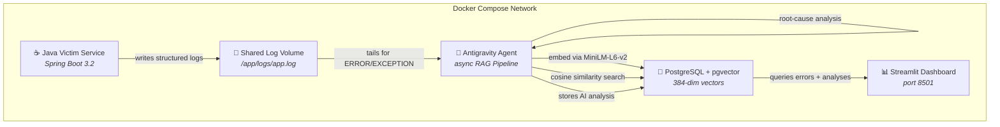

<div align="center">

# 🔍 Autonomous DevOps & Log Debugging Assistant

**An AI-powered microservices system that autonomously monitors a buggy Java service, detects errors in real time, and generates root-cause analysis with corrected code — all running locally via Docker.**

[](https://openjdk.org/)
[](https://spring.io/projects/spring-boot)
[](https://www.python.org/)
[](https://github.com/pgvector/pgvector)
[](https://docs.docker.com/compose/)
[](https://streamlit.io/)

</div>

---

## 🏗️ What This Project Demonstrates

This project is a **portfolio-grade, full-stack microservices system** that showcases:

| Skill Area | Implementation |
|------------|----------------|
| **Distributed Systems** | 4-service Docker Compose architecture with health checks, dependency ordering, and shared volumes |
| **Java Engineering** | Spring Boot 3.2 service with scheduled tasks, algorithm implementations, and structured logging via Logback |
| **AI / ML Engineering** | RAG pipeline with sentence-transformers embeddings, pgvector similarity search, and autonomous AI agent |
| **Database Design** | PostgreSQL with pgvector extension for 384-dim vector storage and IVFFlat indexing |
| **DevOps & Containerization** | Multi-stage Docker builds, Docker Compose orchestration, and production-ready health monitoring |
| **Async Python** | `asyncio`-based log monitoring and agent interaction using the `google-antigravity` SDK |

---

## 📐 Architecture



### Data Flow

```
Java Error → Logback → app.log → Agent Tail → Stack Trace Extraction
    → MiniLM-L6-v2 Embedding (384-dim) → pgvector INSERT
    → Cosine Similarity Retrieval (top-3) → Antigravity Agent Chat
    → Root-Cause Analysis + Code Fix → pgvector UPDATE
    → Streamlit Dashboard renders results
```

---

## 🧩 Components

### 1. Victim Service (Java 17 + Spring Boot 3.2)

A simulated backend worker that runs **approximation algorithms** with intentionally injected bugs:

| Algorithm | Bug Type | Exception | Root Cause |
|-----------|----------|-----------|------------|
| **Facility Location** (greedy approx.) | Off-by-one | `NullPointerException` | Map lookup with out-of-range key → null auto-unboxing |
| **Bin Packing** (First-Fit Decreasing) | Undersized array | `ArrayIndexOutOfBoundsException` | Bin capacity array allocated at `n/2` instead of `n` |
| **Array/String Ops** (palindrome, sort) | Empty string | `StringIndexOutOfBoundsException` | `charAt(0)` called without empty check |
| **Array/String Ops** (static cache) | Memory leak | Gradual OOM | Static `List` grows on every invocation, never cleared |

Errors trigger every ~20 seconds with ~40% probability, producing realistic multi-line stack traces interleaved with `INFO` health-check logs.

### 2. Database (PostgreSQL + pgvector)

- `error_logs` table with `vector(384)` column matching `all-MiniLM-L6-v2` output dimensions
- IVFFlat index for fast cosine similarity search (`<=>` operator)
- Stores raw stack traces, embeddings, exception types, and AI-generated analyses

### 3. AI Engine (Python + google-antigravity SDK)

The RAG pipeline runs as an async Python worker:

1. **Tail** — monitors `app.log` via file-seek position tracking
2. **Extract** — parses multi-line Java stack traces (including `Caused by` chains)
3. **Embed** — converts traces to 384-dim vectors via `sentence-transformers`
4. **Store** — inserts into PostgreSQL with pgvector
5. **Retrieve** — cosine similarity search for top-3 similar past errors
6. **Generate** — `google-antigravity` SDK's `LocalAgentConfig` + `Agent.chat()` produces root-cause analysis and corrected Java code
7. **Persist** — stores the AI analysis back in the database

```python
# Core agent pattern (from agent.py)
agent_config = LocalAgentConfig(
    system_instructions="You are a senior Java engineer..."
)
async with Agent(agent_config) as agent:
    response = await agent.chat(prompt_with_rag_context)
```

### 4. Dashboard (Streamlit)

- **Sidebar**: scrollable list of recent errors with exception type and timestamp
- **Main Panel**: raw stack trace (syntax-highlighted) + AI root-cause analysis + suggested Java fix (Markdown)
- Auto-refresh capability

---

## 🚀 Quick Start

### Prerequisites

- **Docker** & **Docker Compose** v2.20+
- ~4 GB free disk space (for Docker images and embedding model)

### 1. Clone the Repository

```bash
git clone https://github.com/YOUR_USERNAME/autonomous-devops-assistant.git
cd autonomous-devops-assistant
```

### 2. Build & Start (One Command)

```bash
docker compose up --build -d
```

This launches all 3 services:
- **PostgreSQL** with pgvector schema initialized
- **Java Victim Service** begins generating logs and errors immediately
- **AI Engine** downloads the embedding model (first build only), starts monitoring

### 3. Open the Dashboard

```
http://localhost:8501
```

Within **1–2 minutes**, errors will appear in the sidebar. Click any error to see the full stack trace and AI-generated analysis.

### 4. Watch the Logs

```bash
# All services
docker compose logs -f

# Just the AI engine
docker compose logs -f ai-engine

# Just the Java service
docker compose logs -f victim-service
```

---

## 🧪 Local Testing Guide

### Step-by-Step Verification

```bash
# 1. Verify all containers are healthy
docker compose ps

# 2. Confirm the Java service is writing logs
docker compose exec victim-service cat /app/logs/app.log | tail -20

# 3. Check errors are being ingested into PostgreSQL
docker compose exec postgres psql -U devops -d devops_logs \
    -c "SELECT id, timestamp, exception_type FROM error_logs ORDER BY timestamp DESC LIMIT 5;"

# 4. Verify the Antigravity agent is processing errors
docker compose logs ai-engine | grep "Processing new error"

# 5. Confirm Streamlit is responding
curl -s http://localhost:8501 | head -5
```

### Force More Errors

The victim service triggers bugs automatically. To accelerate:

```bash
docker compose restart victim-service
```

### Clean Restart

```bash
docker compose down -v    # removes containers + volumes (clean slate)
docker compose up --build -d
```

---

## 📁 Project Structure

```
autonomous-devops-assistant/
│
├── docker-compose.yml                   # 3-service orchestration
├── push-to-github.sh                    # Git init + push script
├── README.md                            # This file
├── .gitignore
│
├── victim-service/                      # ☕ Java Spring Boot 3.2
│   ├── Dockerfile                       #   Multi-stage: Maven → JRE 17
│   ├── pom.xml
│   └── src/main/
│       ├── java/com/devops/victim/
│       │   ├── VictimApplication.java   #   @SpringBootApplication entry
│       │   ├── config/
│       │   │   └── AppConfig.java
│       │   ├── scheduler/
│       │   │   └── TaskScheduler.java   #   @Scheduled every 20s
│       │   └── algorithms/
│       │       ├── FacilityLocation.java  # NPE bug (off-by-one map key)
│       │       ├── BinPacking.java        # AIOOBE bug (undersized array)
│       │       └── ArrayStringOps.java    # SIOOBE bug + memory leak
│       └── resources/
│           ├── application.properties
│           └── logback-spring.xml       #   Logs to /app/logs/app.log
│
├── database/                            # 🐘 PostgreSQL + pgvector
│   └── init.sql                         #   Schema + IVFFlat index
│
├── ai-engine/                           # 🐍 Python 3.11
│   ├── Dockerfile                       #   Slim + pre-cached model
│   ├── entrypoint.sh                    #   Agent (bg) + Streamlit (fg)
│   ├── requirements.txt                 #   google-antigravity, sentence-transformers
│   ├── config.py                        #   Env-var configuration
│   ├── agent.py                         #   Async RAG pipeline
│   └── app.py                           #   Streamlit dashboard (~50 lines)
│
└── logs/                                # 📁 Docker shared volume
    └── .gitkeep
```

---

## ⚙️ Environment Variables

| Variable | Default | Description |
|----------|---------|-------------|
| `DB_HOST` | `postgres` | PostgreSQL hostname (Docker service name) |
| `DB_PORT` | `5432` | PostgreSQL port |
| `DB_NAME` | `devops_logs` | Database name |
| `DB_USER` | `devops` | Database user |
| `DB_PASSWORD` | `devops_secret` | Database password |
| `LOG_FILE_PATH` | `/app/logs/app.log` | Path to the Java service's log file |
| `POLL_INTERVAL_SECONDS` | `5` | How often the agent polls for new log entries |

> **Note:** No external API keys are required. The `google-antigravity` SDK runs the AI agent locally.

---

## 📤 Push to GitHub

```bash
# Option 1: Use the provided script
chmod +x push-to-github.sh
./push-to-github.sh https://github.com/YOUR_USERNAME/autonomous-devops-assistant.git

# Option 2: Manual commands
git init
git add -A
git commit -m "feat: Autonomous DevOps & Log Debugging Assistant"
git branch -M main
git remote add origin https://github.com/YOUR_USERNAME/autonomous-devops-assistant.git
git push -u origin main
```

---

## 🛠️ Tech Stack Summary

```
┌─────────────────────────────────────────────────────────┐
│                    Docker Compose                       │
├──────────────┬──────────────────┬───────────────────────┤
│  Java 17     │  Python 3.11     │  PostgreSQL 16        │
│  Spring Boot │  antigravity SDK │  pgvector extension   │
│  Logback     │  sentence-xfmrs  │  IVFFlat indexing     │
│  Maven       │  Streamlit       │  384-dim vectors      │
│  @Scheduled  │  asyncio         │  cosine distance      │
└──────────────┴──────────────────┴───────────────────────┘
```

---

## 📄 License

MIT
